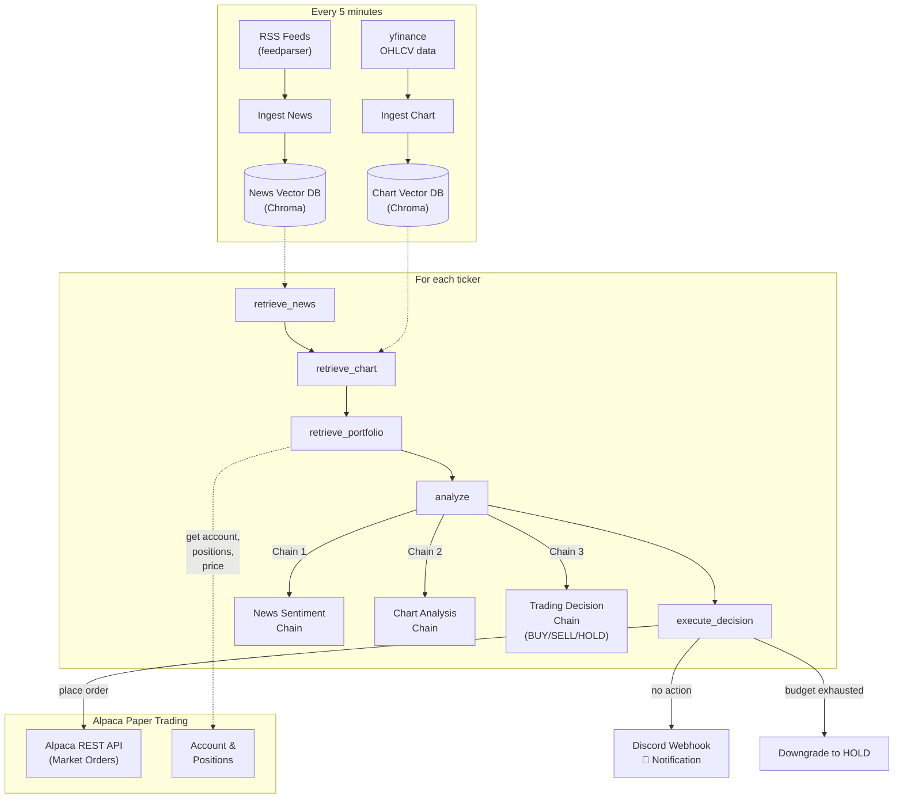

# TraderAI

**LLM-powered stock trading agent** with real-time analysis and Discord notifications.

Built with **LangGraph**, **LangChain**, **ChromaDB**, **OpenAI**, and a **Streamlit dashboard**.

## 📹 Demo Video

Check out how TraderAI works in action:

[![TraderAI Demo]](https://github.com/user-attachments/assets/33544a91-c85f-4746-9c5c-1d797dff7172)


## 🎯 How It Works

```
Background Loop (every 5 minutes per ticker):
  1. Fetch latest news (Tavily API + RSS fallback)
  2. Fetch OHLCV price data (yfinance)
  3. Ingest into vector databases (ChromaDB)
  4. Run LangGraph pipeline:
       RETRIEVE NEWS → RETRIEVE CHART → RETRIEVE PORTFOLIO → ANALYZE → EXECUTE DECISION
  5. Send Discord notification if action taken
  6. Track daily action budget (max 5 per stock)
```

### Decision Flow

| Stage | What Happens |
|-------|--------------|
| **Retrieve News** | Query news vector DB for ticker-relevant articles |
| **Retrieve Chart** | Query chart vector DB for recent price candles |
| **Retrieve Portfolio** | Get live account data, positions & current price from Alpaca |
| **Analyze** | Run 3 LLM chains in parallel (timeout 30s each): |
| | • **News Sentiment** — summarize headline sentiment |
| | • **Chart Technicals** — identify trends & support/resistance |
| | • **Trading Decision** — BUY / SELL / HOLD considering portfolio context |
| **Execute** | Place actual market orders via Alpaca → check daily budget → notify Discord |

### System Architecture



### Budget Rules
- **HOLD** = free (doesn't count against budget)
- **BUY / SELL** = 1 action each (max 5 per stock per day)
- Budget resets at **midnight UTC**
- If exhausted, trades downgrade to HOLD

## 📋 Setup

### 1. Environment Variables

Create `.env` in project root:

```env
# Required
OPENAI_API_KEY=sk-...
TAVILY_API_KEY=tvly-...                    # News search (Tavily.com)
ALPACA_API_KEY=your_alpaca_key             # Paper trading
ALPACA_SECRET_KEY=your_alpaca_secret       # Paper trading

# Optional
ALPACA_BASE_URL=https://paper-api.alpaca.markets
ALPACA_ORDER_QTY=1                         # Shares per trade
DISCORD_WEBHOOK_URL=https://discord.com/api/webhooks/...
TICKERS=AAPL,MSFT,NVDA
MAX_ACTIONS_PER_DAY=5
RUN_INTERVAL_SECONDS=300
LLM_MODEL=gpt-4o
```

### 2. Install & Run

```bash
# Install dependencies
uv sync

# Start Streamlit dashboard (has built-in Start/Stop buttons per ticker)
uv run streamlit run dashboard/app.py

# Or run CLI scheduler in parallel (optional, for when dashboard is closed)
python -m trader_agent.main
```

## 🎮 Streamlit Dashboard

**Tabs:**

| Tab | Purpose |
|-----|---------|
| **Stocks** | Real-time monitoring with Start/Stop buttons. Timer shows when next analysis runs. |
| **Dashboard** | Market overview & recent decision history. |
| **Analysis** | On-demand single-ticker analysis. Run the full pipeline manually. |
| **News Feed** | Browse fetched articles for selected ticker. |
| **Charts** | Interactive candlestick charts with configurable periods & intervals. Shows market hours vs pre/post-market data. |
| **Pipeline** | Visualize the LangGraph workflow and decision rules. |

**Features:**
- ✅ Add/remove tickers via Yahoo Finance search
- ✅ Real-time price cards
- ✅ 1-second countdown timer (Streamlit Fragments)
- ✅ Daily action budget tracker
- ✅ Decision history with full reasoning
- ✅ OpenAI + Discord status indicators
- ✅ Market hours visualization (grey = pre/post market, colored = regular hours)

## 📁 Project Structure

```
trader_agent/
├── config.py                    # All configuration & env vars
├── main.py                      # CLI scheduler entry point
│
├── core/
│   ├── rss_fetcher.py           # Tavily + RSS news fetching
│   ├── chart_fetcher.py         # yfinance OHLCV fetching
│   ├── ingestion.py             # ChromaDB vector store (news + chart)
│   └── discord_notifier.py      # Discord webhook notifications
│
├── graph/
│   ├── state.py                 # GraphState TypedDict
│   ├── consts.py                # Node name constants
│   ├── graph.py                 # LangGraph workflow
│   ├── chains/
│   │   ├── news_analyzer.py
│   │   ├── chart_analyzer.py
│   │   └── trading_decision.py
│   └── nodes/
│       ├── retrieve_news.py
│       ├── retrieve_chart.py
│       ├── analyze.py
│       └── execute_decision.py
│
└── dashboard/
    ├── app.py                   # Main Streamlit app
    ├── helpers.py               # Threading loops + shared helpers
    └── tabs/
        ├── tab_stocks.py        # Monitoring & control
        ├── tab_dashboard.py     # Market overview
        ├── tab_analysis.py      # On-demand analysis
        ├── tab_news.py          # News feed
        ├── tab_charts.py        # Interactive charts
        └── tab_pipeline.py      # Workflow visualization
```

## 🔄 Threading & Persistence

- **Background loops:** Module-level threading (survives Streamlit reruns)
- **Session persistence:** `.actions_today.json` tracks daily budget across sessions
- **Decision history:** `.decisions.json` stores all past trades
- **Custom tickers:** `.custom_tickers.json` persists user-added symbols

## 📊 Data Management

**News Vector Store:**
- Collection: `news-store`
- Source: Tavily API (primary) + RSS feeds (fallback)
- Content: Title + full article body
- Batch ingestion: 10 docs/batch to avoid memory issues

**Chart Vector Store:**
- Collection: `chart-store`
- Source: yfinance (5d history, 5m candles)
- Content: OHLCV + summary stats
- Downsampling: max 50 candles per ticker

## ⚙️ Configuration

All settings live in `config.py` and can be overridden via `.env`:

| Setting | Default | Purpose |
|---------|---------|---------|
| `LLM_MODEL` | `gpt-4o` | OpenAI model |
| `LLM_TEMPERATURE` | `0.0` | Deterministic decisions |
| `RUN_INTERVAL_SECONDS` | `300` | 5-minute loop interval |
| `MAX_ACTIONS_PER_DAY` | `5` | Budget per stock |
| `CHART_PERIOD` | `5d` | yfinance history period |
| `CHART_INTERVAL` | `5m` | yfinance candle interval |

## 🚀 Deployment Tips

1. **Use threading, not subprocesses** — dashboard loop continues across page refreshes
2. **Set `OPENAI_API_KEY` & `TAVILY_API_KEY`** — required for LLM & news fetching
3. **Discord webhook (optional)** — trades are logged but won't send if not configured
4. **Run Streamlit in multi-user mode** if accessing from multiple devices
5. **Monitor logs** — ticker loops print to stdout with `[LOOP]` prefix

## 📝 License

MIT

